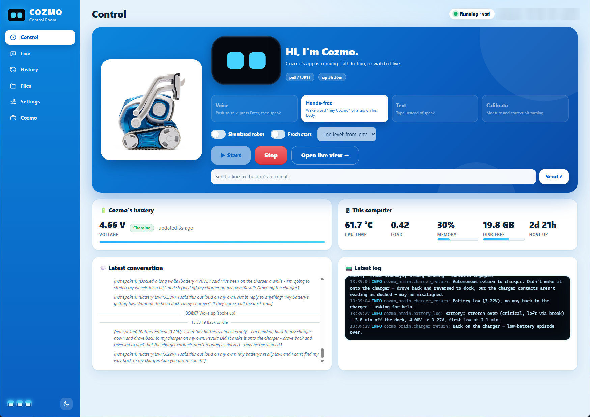

# SmartCozmo

Turn an old Anki/DDL **Cozmo** robot into an LLM-driven assistant — speak to
it, an LLM decides what it should say/do, and [PyCozmo](https://github.com/zayfod/pycozmo)
executes it on the real robot. No phone/Cozmo app involved; everything runs
headless from a Raspberry Pi.

> **Unofficial hobby project.** Not affiliated with, endorsed by, or supported
> by Digital Dream Labs or Anki. "Cozmo" is a trademark of its respective
> owner. This repo contains no Anki/DDL animations or sounds; those are
> downloaded or extracted locally on your own machine (see
> [Real animation clips and Cozmo's own sounds](docs/clip-sounds.md)).
> Developed and tested on one Raspberry Pi 5 and one Cozmo, so expect rough
> edges on other setups.

```
Bluetooth mic
     │  (arecord, 16kHz mono)
     ▼
Groq Whisper STT  (speech → text)
     │
     ▼
Ollama, tool-calling model  (decides what to do)
     │  tool_calls: say() / drive() / turn()
     ▼
PyCozmo  (talks to Cozmo over its own Wi-Fi AP)
     ├─ drive/turn → cli.drive_wheels(...)
     └─ say(text)  → Groq TTS (Orpheus) → cli.play_audio(...)
```

**Status:** Three things live here now:

- **`standalone/orchestrator.py`** — the original single-file proof of concept. Kept
  as-is on purpose, as a lightweight script for quickly testing mic → STT →
  LLM → PyCozmo → TTS on the Pi without the full app.
- **`cozmo_brain/`** — the real application: conversation memory, a proper
  tool-calling agentic loop, a curated gesture/mood library built on
  confirmed PyCozmo primitives, real animation clip playback, camera-in-
  the-loop vision, hands-free VAD listening, a turn-calibration mode, an
  optional hand-off to your own assistant agent (reminders, web lookups -
  see [Asking your own assistant](docs/assistant.md#asking-your-own-assistant-ask_assistant)),
  and a simulated robot backend for developing away from the hardware. See
  [The cozmo_brain/ application](docs/architecture.md#the-cozmo_brain-application).
- **`cozmo_dashboard/`** — the Control Room, a web page for starting/stopping
  Cozmo in any mode and watching the live log, conversations, history and
  files, with a `.env` editor. Standard-library only; see
  [The dashboard](docs/dashboard.md).



See [Roadmap](docs/roadmap.md#roadmap--open-work) for what's still open.

---

## How this project is meant to be worked on

- **Cozmo only talks to whatever machine is joined to his own Wi-Fi access
  point.** In practice that's the Raspberry Pi, since it also needs a
  Bluetooth mic/speaker paired to it and a second network interface for
  internet access. Treat the Pi as the **deployment target**.
- Everything that isn't a `pycozmo.Client` call or a local `arecord`
  invocation is plain HTTP (Groq, Ollama) and can be developed and tested on
  any machine.
- `cozmo_brain/` has a **simulated robot backend** (`--simulate`, or
  `ROBOT_BACKEND=simulated` in `.env`) that logs every action to the console
  instead of touching hardware — the entire tool-calling loop, conversation
  memory, and gesture library can be developed and demoed on a plain dev
  machine with no Cozmo, no PyCozmo Wi-Fi link, and no Bluetooth mic
  attached. `--mode text` pairs well with this, since it also skips the mic.
- Suggested loop: edit/prototype on your dev machine with `--simulate --mode
  text` → sync to the Pi → run for real for anything that needs to actually
  touch the robot, the mic, or the speaker.

---

## Requirements

**Hardware**
- Anki/DDL **Cozmo** robot (any firmware that still exposes its own Wi-Fi AP
  when you raise/lower its lift)
- A machine that can join Cozmo's Wi-Fi AP *and* stay on the internet at the
  same time — a **Raspberry Pi 5** running Ubuntu with wired Ethernet + Wi-Fi
  is what this project targets, but any Linux box with two network
  interfaces works
- A Bluetooth mic/speaker (this project used a Bose SoundLink Flex)

**Tested on:** Raspberry Pi 5, Ubuntu 24.04 LTS (aarch64), Python 3.12.

**Accounts / services**
- [Groq](https://console.groq.com) API key — used for STT (Whisper) and TTS
  (Orpheus) by default; `STT_PROVIDER`/`TTS_PROVIDER` can each independently
  switch to OpenAI instead (see [Configuration reference](docs/configuration.md#configuration-reference))
- An [Ollama](https://ollama.com) endpoint reachable from the deployment
  machine, serving a model that supports **tool-calling** (this project uses
  a cloud-hosted model proxied through a local Ollama instance). Either pull
  a local model, or sign in to Ollama (`ollama signin`) to use its cloud
  models, such as the `-cloud` model `.env.example` starts with

---

## Quick start

Full steps, with the gotchas, are in [Setup from scratch](docs/setup.md).

```bash
git clone https://github.com/sun4git/SmartCozmo.git && cd SmartCozmo
python3 -m venv cozmo-env && source cozmo-env/bin/activate && pip install -r requirements.txt
pycozmo_resources.py download         # Cozmo's animation/sound files, needed for his animations
cp .env.example .env                  # then fill in GROQ_API_KEY, OLLAMA_BASE_URL, OLLAMA_MODEL
./run.sh --simulate --mode text       # sanity-check .env/Groq/Ollama without the robot
./run.sh --mode voice                 # push-to-talk on the real robot
./run.sh --mode vad                   # hands-free (needs the wake-word setup, see below)
./dashboard.sh                        # Control Room web UI, http://localhost:30540
```

- **Groq's voice needs a one-time click:** before TTS works, accept the
  Orpheus model's terms once in the
  [Groq playground](https://console.groq.com/playground?model=canopylabs%2Forpheus-v1-english).
  Until then, speaking fails with `model_terms_required`.
- **Hands-free mode** (`--mode vad`) needs two extra installs, `webrtcvad-wheels`
  and openWakeWord (not a plain `pip install`). See
  [Setup from scratch](docs/setup.md#1-python-environment-on-the-deployment-machine)
  and [Wake word](docs/wake-word.md).

After a `git pull`, run `python3 standalone/sync_env.py` to see which new
`.env` settings you're missing.

---

## Documentation

Everything that used to be in this one file now lives in [docs/](docs/), grouped by topic.

**Getting started**

| Page | What's in it |
|---|---|
| [Setup from scratch](docs/setup.md) | Python environment, `.env`, joining Cozmo's Wi-Fi (incl. passwordless nmcli), PyCozmo check, Bluetooth mic/speaker, Groq setup, running it, log levels |
| [The dashboard](docs/dashboard.md) | The Control Room web UI: start/stop Cozmo, live log, history, `.env` editor |
| [Repo layout](docs/repo-layout.md) | What every folder and module is for |
| [Configuration reference](docs/configuration.md) | The `.env` settings, one row each (`.env.example` is the source of truth) |
| [Example conversations](docs/examples.md) | Real captured sessions, and more things to try |
| [Troubleshooting cheat sheet](docs/troubleshooting.md) | Commands for checking network, Bluetooth, STT, TTS, Ollama, the assistant and PyCozmo |
| [Known gotchas](docs/known-gotchas.md) | Quirks of the Pi, Cozmo's Wi-Fi, PyCozmo and Groq |

**How it works**

| Page | What's in it |
|---|---|
| [Architecture, modes and tools](docs/architecture.md) | The engine loop, `--mode voice/vad/text/calibrate`, every tool the LLM can call, moods and gestures |
| [How a turn ends (`FINAL_LLM_CALL`)](docs/turn-flow.md) | `async`/`sync`/`skip`, when a turn may stop early, how to read the log |
| [Conversation history and memory](docs/memory.md) | The archive in `data/history/`, `memory.md`, suggested facts, search, privacy |
| [Asking your own assistant](docs/assistant.md) | `ask_assistant`: reminders and web lookups through OpenClaw or any OpenAI-compatible agent |
| [Recognizing people](docs/people-recognition.md) | `remember_person`, `who_is_this` and the optional presence check |
| [Wake word](docs/wake-word.md) | openWakeWord setup, the backpack-light cues, training a custom wake word, model files |
| [Speech-to-text hallucinations](docs/stt-hallucination.md) | The layered defenses, and live measurements per provider |
| [Audio output and voice](docs/audio-output.md) | Routing speech to a real speaker (and where clip sounds go then), making the voice less generic, `TTS_GAIN` |
| [Speech and chat providers](docs/providers.md) | Groq, OpenAI, local, Wit.ai, Edge; chat and vision provider switching |
| [Connection and battery](docs/connection-and-battery.md) | Dropped-connection recovery, the battery monitor, the battery line and charger break, `battery.jsonl` |
| [Real animation clips and Cozmo's own sounds](docs/clip-sounds.md) | The curated clips, getting Cozmo's original sounds working (extraction, copying, settings), keeping a backup |
| [Return to the charger](docs/return-to-charger.md) | The low-battery policy, navigation, docking, and what was learned on hardware |

**Development**

| Page | What's in it |
|---|---|
| [Standalone scripts](docs/standalone-scripts.md) | `sync_env.py`, `show_history.py`, `battery_report.py`, `orchestrator.py`, `pose_drift_test.py`, and the clip/sound tools |
| [Running the tests](docs/testing.md) | The offline test suite and the opt-in live tests |
| [Real bugs this uncovered](docs/hardware-findings.md) | Problems that only showed up on real hardware, and how they were fixed |
| [Roadmap / open work](docs/roadmap.md) | What's done and what's still open |
| [Physical sensors (roadmap item 4)](docs/roadmap-physical-sensors.md) | Tap, cliff, pickup, charger-safe wheels, idle fidgets: detail and hardware status |

---

## License

Apache License 2.0. See [LICENSE](LICENSE) and [NOTICE](NOTICE).

**Exception:** the wake-word model [models/hey_cozmo.onnx](models/hey_cozmo.onnx)
is **not** Apache-licensed. Its training data has mixed licenses, so it is for
non-commercial, personal use only (details in [NOTICE](NOTICE) and
[Wake word](docs/wake-word.md#training-a-custom-wake-word)).

## Contributions

This is a personal project, and pull requests aren't being accepted for now.
